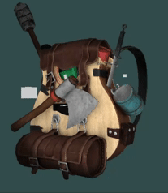

# OpenGL Rendering Exploration (C++ / OpenGL 3.3)

This repository contains a set of small rendering programs used to explore real-time graphics fundamentals in modern OpenGL.

The code initially followed the LearnOpenGL material, but was gradually refactored and reorganised while working through the material and exercises.  
The focus was on understanding responsibilities inside a rendering pipeline rather than reproducing tutorial structure.

Running the program opens an interactive scene used to experiment with camera, lighting and object behaviour. The application serves as a single place to modify and observe different parts of the rendering pipeline.

## Areas explored

- Separation of mesh, model, and shader responsibilities
- Camera behaviour and view/projection transforms
- Lighting models (ambient, phong, multiple lights)
- GPU resource handling (buffers, textures, shader state)
- Debugging rendering issues and incorrect state
- Refactoring tutorial code into reusable components

### Debug Views
The application includes debug views to visualize intermediate rendering results:
- Normal visualization
- Depth visualization
- Diffuse texture visualization
- Lights visualization

## Building (Windows / Visual Studio)

The project is provided as a Visual Studio solution.

1. Clone the repository
2. Open `LearnOpenGL.sln` in Visual Studio 2022 (or 2019)
3. Build and run the desired target

The project assumes an OpenGL 3.3 compatible GPU.

### Dependencies

The project uses a `vcpkg.json` manifest for dependency resolution (GLFW, GLM, GLAD).

When opening the project in Visual Studio with vcpkg integrated, dependencies are restored automatically.
Otherwise, run:

vcpkg install
