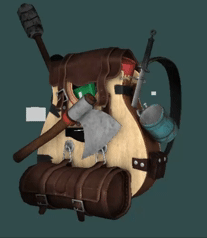

# OpenGL Rendering Exploration (C++ / OpenGL 3.3)

This repository contains a set of small rendering programs used to explore real-time graphics fundamentals in modern OpenGL.

The code initially followed the LearnOpenGL material, but was gradually refactored and reorganised while working through the material and exercises.  
The focus was on understanding responsibilities inside a rendering pipeline rather than reproducing tutorial structure.

Running the program opens an interactive scene used to experiment with camera, lighting and object behaviour. The application serves as a single place to modify and observe different parts of the rendering pipeline.

## Areas explored

- Separation of mesh, model, and shader responsibilities
- Camera behaviour and view/projection transforms
- Lighting models (ambient, phong, multiple lights)
- GPU resource handling (buffers, textures, shader state)
- Debugging rendering issues and incorrect state
- Refactoring tutorial code into reusable components

## Debug Views

The application includes debug views to visualize intermediate rendering results:

- Normal visualization  
- Depth visualization  
- Diffuse texture visualization  
- Lights visualization  

Rendering state was inspected using RenderDoc during development.



## Building

> **Windows only.** Linux support has not been tested.

The project uses CMake with vcpkg for dependency management.

Required tools:

- CMake (3.20+)
- Ninja
- vcpkg
- MSVC toolchain + Windows SDK (Visual Studio Build Tools is sufficient; full Visual Studio IDE is optional)

1. Clone the repository
2. Ensure `VCPKG_ROOT` is set to your vcpkg installation
3. Open an x64 MSVC developer shell (required for configure, or any time the build cache is recreated)
4. Run:

```
cmake --preset debug
cmake --build --preset debug
```

> Note: A plain command prompt is not guaranteed to work unless your environment already resolves to x64 `cl.exe`.

The executable is output to `build/debug/LearnOpenGL.exe`.

Subsequent rebuilds after code changes only need:

```
cmake --build --preset debug
```

### clang-tidy

`clang-tidy` is enabled during normal builds by default (`ENABLE_CLANG_TIDY_ON_BUILD=ON`).

To disable it for faster local builds:

```
cmake --preset debug -DENABLE_CLANG_TIDY_ON_BUILD=OFF
```

You can also run it manually via the dedicated target:

```
cmake --build --preset debug --target tidy
```

The project assumes an OpenGL 3.3 compatible GPU.

### Opening in Visual Studio

Open the repo folder via **File → Open → CMake Project** and select `CMakeLists.txt`. Visual Studio will configure automatically.

### Dependencies

The project uses a `vcpkg.json` manifest for dependency resolution (GLFW, GLM, GLAD, Assimp). Dependencies are restored automatically during the configure step.
